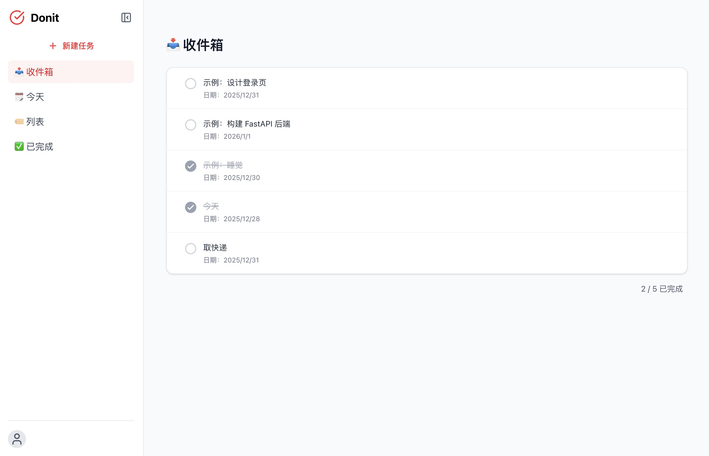
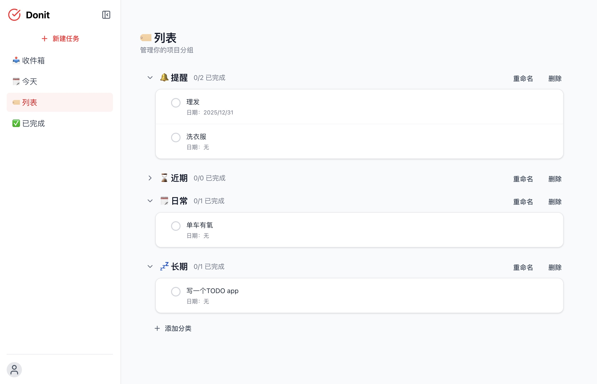

# donit 项目说明文档

## 1. 技术选型
- **编程语言**：TypeScript 前端 + Python 后端；理由：TS 提供更安全和清晰的的静态类型。
- **框架/库**：前端：React + Vite + Tailwind CSS；后端：FastAPI。理由：React 组件化便于扩展且生态成熟；Vite 提升开发效率和体验；Tailwind 可高效开发简洁现代的前端样式；FastAPI 类型校验与自动文档支持良好，可快速搭建类型安全的 REST API。
- **数据库/存储**：SQLite，理由：轻量易部署，适合快速 demo。  
- 替代方案对比：纯前端 + localStorage 无法跨设备同步；MongoDB 不适合强结构的 todo task；Django 对于该项目来说过重。

## 2. 项目结构设计
- 采用前后端分离的结构，前端通过 REST API 与后端通信，后端负责持久化与业务逻辑。
- 目录结构示例：
  ```
  frontend/
    src/
    	api/
      components/
      contexts/
      locales/
      pages/
  backend/
    app/
      config.py
    	crud.py
    	database.py
    	main.py
    	models.py
    	schemas.py
  ```
- 模块职责说明

  - `backend/models.py` / `schemas.py`：定义 DB 表结构与 API 输入/输出模型
  - `backend/crud.py`：封装数据库操作
  - `backend/routers/todos.py`：暴露 REST 接口
  - `frontend/api/Client.ts`：封装对后端 API 的调用
  - `frontend/components`：UI 组件，负责展示和用户交互
  - `frontend/pages`：页面级组件，组织布局和路由
  - `frontend/contexts`：全局状态管理
  - `frontend/locales`：多语言支持资源文件


>   
>
> 前端主要页面截图  

## 3. 需求细节与决策
- 描述日期非必填，默认分类进入 inbox，前端处理空输入。
- 已完成的任务可以在“已完成”视图查看，支持批量删除。  
- 用户可自定义任务分类，并在列表视图按分类查看任务。 
- 删除操作需要二次确认，防止误操作。

## 4. AI 使用说明
- 使用 Copilot 和 Gemini
- 使用 AI 的环节：  
  - 方案讨论
  - 部分代码生成
  - 前端样式
  - 优化建议（customevent，showerror）
- AI 输出修改：AI 给出纯前端 + localStorage 方案，改为前后端 + SQLite 以支持多设备/多用户扩展能力。  

## 5. 运行与测试方式
#### 后端

```bash
cd backend
python -m venv venv
source venv/bin/activate
pip install -r requirements.txt
uvicorn main:app --reload # http://127.0.0.1:8000
```

#### 前端

```bash
cd frontend
npm install
npm run dev # http://localhost:5173
```

#### 已测试环境

Node.js v24; Python 3.8; macOS 26

## 6. 总结与反思
- 如果有更多时间，你会如何改进？  
  - 增加用户认证和多用户数据隔离。
  - 增加任务通知推送。
  - 增加更丰富的 task 字段（优先级、标签等）。
- 你觉得这个实现的最大亮点是什么？  
  - 简洁且可演进的全栈结构：前后端分离、类型契约明确，容易在后续扩展同步/权限功能。
  - FastAPI 与 Pydantic/SQLModel 的使用使 API 类型安全且自带可交互文档。
  - Tailwind CSS 让前端样式开发高效且易于维护。
  - 预留多语言支持。